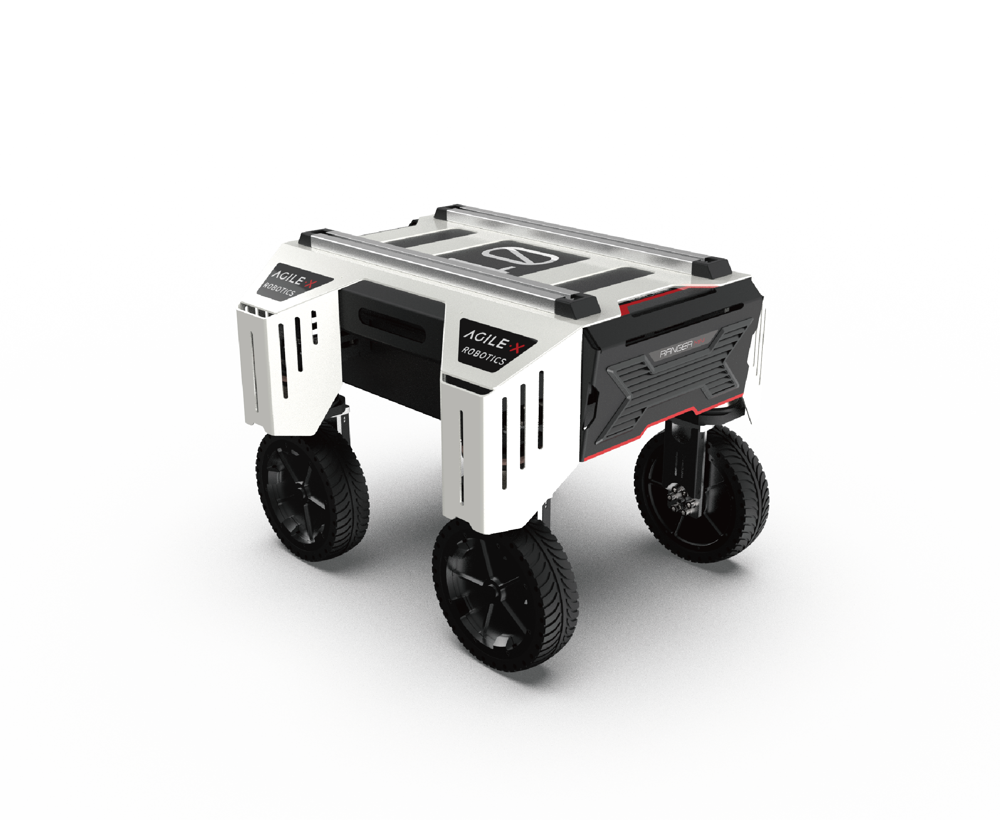
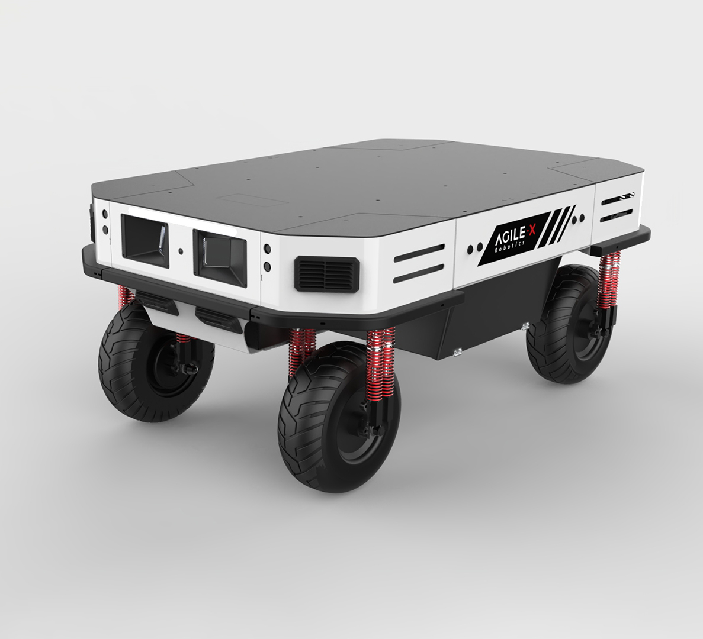

# ROS Packages for Ranger Robot

This repository contains ROS support packages for the Ranger robot bases to provide a ROS interface to the robot.

## Supported hardware

* Ranger Mini V1.0


* Ranger Mini V2.0


* Ranger


## Build the package

1. Install dependencies

```bash
$ sudo apt install libasio-dev libboost-all-dev
```

2. Clone and build the packages in a catkin workspace

```bash
$ cd ~/catkin_ws/src
$ git clone https://github.com/westonrobot/ugv_sdk.git
$ git clone https://github.com/agilexrobotics/ranger_ros.git
$ cd ..
$ catkin_make
```
3. Setup CAN-To-USB adapter

* Enable gs_usb kernel module(If you have already added this module, you do not need to add it)
    ```
    $ sudo modprobe gs_usb
    ```
    
* first time use scout-ros package
   ```
   $ rosrun ranger_bringup setup_can2usb.bash
   ```
   
* if not the first time use scout-ros package(Run this command every time you turn off the power) 
   ```
   $ rosrun ranger_bringup bringup_can2usb.bash
   ```
   
* Testing command
    ```
    # receiving data from can0
    $ candump can0
    ```

4. Launch ROS nodes

* Start the base node for ranger

    ```shell
    $ roslaunch ranger_bringup ranger.launch #for ranger
    ```


## ROS interface

### Parameters

* can_device (string): **can0**
* robot_model (string): **ranger**/ranger_mini_v1/ranger_mini_v2
* update_rate (int): **50**
* base_frame (string): **base_link**
* odom_frame (string): **odom**
* publish_odom_tf (bool): **true**
* odom_topic_name (string): **odom**

### Published topics

* /system_state (ranger_msgs::SystemState) - 系统状态信息
* /motion_state (ranger_msgs::MotionState) - 运动状态信息
* /actuator_state (ranger_msgs::ActuatorStateArray) - 执行器状态数组
* /odom (nav_msgs::Odometry) - 里程计数据（可通过 odom_topic_name 参数配置）
* /battery_state (sensor_msgs::BatteryState) - 电池状态信息
* /tf (tf/tfMessage) - 坐标变换信息（当 publish_odom_tf=true 时发布）

**实际运行时完整话题列表：**
```bash
$ rostopic list
/actuator_state
/battery_state
/cmd_vel
/motion_state
/ranger_base_node/odom    # 根据 odom_topic_name 参数可能显示为 /odom
/rosout
/rosout_agg
/system_state
/tf
```

### Subscribed topics

* /cmd_vel (geometry_msgs::Twist) - 速度控制指令（线性速度和角速度）

**注意：** `/cmd_vel` 是订阅话题，需要外部节点（如 `teleop_twist_keyboard`）发布速度指令才能控制底盘移动。

### Services
