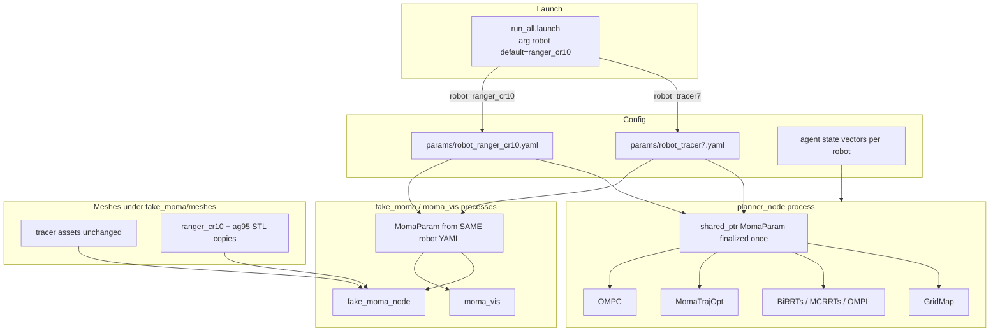

# TopAY Ranger+CR10 Dual-Robot Design

**Date:** 2026-08-11  
**Revised:** 2026-08-12 (review feedback incorporated)  
**Status:** Revised — awaiting re-approval before implementation planning  
**Scope:** TopAY simulation only — Phase A robot geometry/FK/planning swap to Ranger chassis + CR10 arm + AG95 gripper; keep original Tracer+7DOF switchable.

## 0. Review Delta (2026-08-12)

P0 items that blocked “implement from previous draft”:

1. CR10 mount Z/frame convention must not reuse TopAY `chassis_height + relative_t.z`.
2. Multiple independent `MomaParam` instances must load the same finalized profile (prefer shared `shared_ptr` injection inside planner process).
3. Obstacle vs self collision radii must be separate data.
4. CR10 long links need variable-count collision spheres (not fixed 2 per link).
5. `fake_moma` / `moma_vis` must use the same CR10 transform backend; repo-wide DOF/marker hardcodes must go.
6. Direct EE 6D goal interface is **out of scope for Phase A** (TopAY today is base SE(2) goal + random feasible arm terminal); deferred to Phase B.

## 1. Goals and Non-Goals

### Goals (Phase A)

- Default TopAY sim/planning stack runs **Ranger geometry + CR10 (6-DOF) kinematics + AG95 closed envelope**, with **TopAY virtual differential-drive base semantics** (not real Ranger 4WS).
- Original **Tracer + 7-DOF** remains available via `robot:=tracer7`.
- Geometry / FK / collision proxies come from REMANI-proven CR10 math + `mm_param_ranger_cr10.yaml`, adapted to TopAY’s APIs.
- AG95 uses vendored meshes plus a **multi-sphere (or capsule+sphere) fixed-closed** collision envelope (fingers do not open/close in planning).
- Keep TopAY algorithms, primary topic names, and Docker workflow unchanged.

### Non-Goals (Phase A)

- Real-robot AGX bridge / ServoJ / Ranger `cmd_vel` closed loop (**Phase C**).
- Full Dual-Ackermann / 4WS Ranger dynamics (**Phase C**).
- **Direct 6D end-effector pose goal interface** (`/ee_goal` → whole-body terminal state). Existing TopAY **base-SE(2) goal + random feasible arm terminal** semantics are preserved (**Phase B**).
- Claiming TopAY `(v, ω)` clamps reproduce REMANI coupled left/right virtual-wheel feasibility (approximation only unless coupled constraints are added later).
- Full benchmark/ablation re-tuning for Ranger footprint; Phase A uses a dedicated open smoke scene plus tracer regression.

### Phasing

```text
Phase A  TopAY + Ranger geometry + CR10 FK/collision + virtual-diff base  ← this spec
Phase B  EE 6D pose → whole-body terminal state
Phase C  Real Ranger motion model / hardware bridge
```

## 2. Architecture



| Unit | Responsibility | Interface |
|------|----------------|-----------|
| `params/robot_*.yaml` | Full robot profile (kinematics, collision, meshes, limits) | ROS params under agreed prefix |
| `MomaParam::fromRos` / `validateAndFinalize` | Load → resize → build kinematics → build proxies → build ignore matrix → validate | Returns fully initialized object; no half-init |
| Shared `shared_ptr<MomaParam>` in planner | Inject into GridMap / RRTs / OMPL / TrajOpt / MPC | `setMomaParam(...)` (or equivalent) |
| Per-node `MomaParam` in sim/vis | Independent process; **must load identical profile** via same launch YAML | Same `robot:=` |
| `getLinkTransforms(state)` | Single FK source of truth for meshes, EE, collision centers | Backend-specific |
| Launch | Select YAML; default `ranger_cr10` | `robot:=ranger_cr10\|tracer7` |

### P0 — Profile consistency

TopAY today constructs **many independent** `MomaParam` members (Planner, GridMap, BiRRTs, MCRRTs, OMPL, MPC, TrajOpt, fake_moma, moma_vis). Loading only in `Planner::init()` is **forbidden** as the completion criterion.

**Required:**

1. Inside `planner_node`: one finalized `shared_ptr<const MomaParam>` (or mutable-but-frozen after finalize) injected into every submodule that currently owns a private `MomaParam`.
2. Inside `fake_moma` / `moma_vis`: each creates its own object but loads the **same** `robot_*.yaml` from launch; startup logs print `robot`, `dof_num`, `kinematics`, mount XYZ for operator verification.
3. Optional hardening: publish a small `robot_profile` diagnostic string/hash on `/topay/robot_profile` from each node and warn on mismatch.

### P0 — Finalize pipeline after load

Constructor defaults must not leave 7-DOF-derived arrays alive under `dof_num=6`.

```text
fromRos(nh) / loadFromRos(nh)
  → resize dynamic arrays for dof_num
  → buildKinematics()
  → buildCollisionProxies()
  → buildCollisionIgnoreMatrix()
  → validate()   // sizes, radii, mesh list length, kinematics enum
```

Prefer factory `MomaParam::fromRos(nh)` returning a fully initialized object.

## 3. Kinematics Backends (Critical)

TopAY’s built-in FK uses an **alternating-axis** chain. REMANI CR10 uses `getAJointTran` + `manipulator_config`. Not interchangeable by changing `dof_num` / lengths alone.

```text
kinematics: topay_alt | cr10
```

| Value | Robot | Behavior |
|-------|-------|----------|
| `topay_alt` | `tracer7` | Existing FK / collision / grads unchanged |
| `cr10` | `ranger_cr10` | REMANI-aligned CR10 transforms + mount; see frame rule below |

### P0 — CR10 mount / base-frame convention (do not reuse TopAY z stacking)

**Forbidden for `kinematics: cr10`:**

```cpp
now_p.z = chassis_height;
now_p += relative_t;   // with relative_t.z = 0.1  → wrongly yields ~0.25 m
```

REMANI mount is a transform **from mobile-base frame** to CR10 base:

\[
T^{W}_{CR10,0} = T^{W}_{base}(x,y,\psi)\, T^{base}_{mount},\quad
T^{base}_{mount}=T(0.2462,\,0,\,0.1)
\]

- `chassis_height = 0.15` is for **chassis collision / base mesh only**, and **must not** enter the CR10 arm FK chain.
- Document mount as `T_base_mount` (or equivalent named fields), not as TopAY `relative_t` stacked on `chassis_height`.

`topay_alt` may keep historical `chassis_height + relative_t` convention for Tracer regression.

### Unified transform API

```cpp
struct KinematicResult {
  std::vector<Eigen::Matrix4d> link_T; // base, arm links, ...
  Eigen::Matrix4d ee_T;                // tool / tip used for EE + AG95 attach
};

KinematicResult getLinkTransforms(const Eigen::VectorXd& state) const;
```

Derived APIs **must** call this (no second FK in sim/vis):

- `getFKPose` ← `ee_T`
- collision sphere centers ← sample along `link_T`
- `fake_moma` / `moma_vis` mesh poses ← `link_T` (+ AG95 relative to tip)
- `getEEGrads` / `getColliGrads` ← analytic derivatives of the **same** CR10 map (required in Phase A; no silent finite-diff fallback that ships)

Reuse REMANI `test_cr10_fk` math / reference as the correctness oracle.

## 4. Collision Model (P0)

### Dual radii

TopAY today has a single `colli_point_radius` used for both env and self checks. That cannot encode REMANI:

```yaml
manipulator_thickness: 0.10
manipulator_self_thickness: 0.045
```

**Required representation** (conceptually):

```cpp
struct CollisionSphere {
  Eigen::Vector3d center;      // filled at query time from transforms
  double obstacle_radius;      // env / GridMap
  double self_radius;          // arm–arm / arm–chassis self checks
  int link_id;
};
```

Or parallel arrays `colli_obs_radius` / `colli_self_radius` with identical topology. GridMap / `isSelfCollision` must use the appropriate radius field.

### Variable sphere count per link

Do **not** keep TopAY’s fixed `for (j=0;j<2;j++)` sampling for CR10. Links of length ~0.607 m and ~0.568 m with \(r\approx0.10\) need denser sampling (config list or auto \(N_i=\lceil L_i/(k r)\rceil\)) so sphere coverage has no large gaps.

Ignore / adjacent topology must be rebuilt for the CR10 sphere graph after finalize (not reuse Tracer’s hard-coded `colli_link_map` of length 12).

### Chassis footprint (P1 wording)

A single circumscribed disk for 1.10×0.90 m is \(r\approx0.711\) m and is **very conservative** for narrow corridors. Phase A may keep a disk for minimal algorithm change, but:

- Document that this is conservative, not “Ranger-accurate”.
- Prefer REMANI-style multi-check points later if needed.
- **Do not** treat failure on Tracer-era narrow maps as Phase A blocker; use an open `ranger_cr10_smoke` scene for success criteria.

### AG95 envelope (P1 upgrade from single tip sphere)

Fixed-closed planning envelope (no finger DOFs):

- Prefer **≥2–3 spheres** (body + left/right or front pair) **or** 1 capsule + 1 sphere covering body and fingertips.
- A single TCP sphere is only allowed as temporary debug, not as the shipped closed envelope.

## 5. Parameter Mapping

### Source of truth

`remani_planner/.../mm_param_ranger_cr10.yaml` for footprint, virtual-diff params, mount, CR10 config/limits/thicknesses.

### `robot_ranger_cr10.yaml` (conceptual fields)

| Field | Mapping / note |
|-------|----------------|
| Footprint L/W/H | 1.10 / 0.90 / 0.15 — height for chassis geom only |
| `T_base_mount` | `[0.2462, 0, 0.1, 0, 0, 0]` — **FK input; not added on top of chassis_height** |
| `dof_num` | 6 |
| `manipulator_config` / joint limits | From REMANI |
| `obstacle_thickness` / `self_thickness` | 0.10 / 0.045 |
| Collision sphere samples | Explicit or auto-generated per link + AG95 multi-sphere |
| `max_v`, `max_w`, … | **Conservative TopAY-style independent clamps** derived from wheel omega×radius / track; **not** claimed as REMANI coupled wheel-feasible set |
| `kinematics` | `cr10` |
| Mesh list | Vendored under `fake_moma/meshes/ranger_cr10/` |

### Speed-limit wording (required)

> TopAY virtual differential limits are derived **conservatively** from REMANI Ranger simulation wheel parameters. They do **not** reproduce REMANI’s coupled left/right virtual-wheel feasibility unless those coupled constraints are explicitly implemented.

### Tracer profile

Literal extraction of current constructor defaults; `kinematics: topay_alt`.

### Agent state dimensions

- `tracer7`: length **10** = `(x,y,yaw)+7q`
- `ranger_cr10`: length **9** = `(x,y,yaw)+6q`

Launch-selected overlay YAML required.

## 6. Repo-Wide De-Hardcoding (not planner-only)

Grep and fix across TopAY (planner **and** sim/vis):

```text
.tail(7)
Zero(10) / state12d assumptions tied to 7
dof_num = 7 literals
markers[8] and other fixed marker indices
link1-7 / q1-q7 naming assumptions in arrays
```

`MomaState` / `MomaCmd` stay variable-length. Runtime asserts: `q` / `arm_odom` size == `dof_num`.

Marker layout must be **indexed by role** (base, arm_base, joint i, gripper), not magic indices that assumed 7 arm links.

## 7. Simulation and Visualization

- Vendor ranger / cr10 / ag95 meshes into `TopAY/src/simulator/fake_moma/meshes/ranger_cr10/` for Docker self-containment; keep Tracer assets.
- **P0:** Delete local alternating-axis FK loops in `moma_sim` / `moma_vis`; pose every mesh from `getLinkTransforms()`.
- Collision debug markers from the same sphere list used by planning.
- Startup log: robot name, dof, kinematics, mount XYZ, chassis_height (and that mount is not stacked for CR10).

## 8. Launch UX

```bash
roslaunch planner run_all.launch rviz:=true                 # default ranger_cr10
roslaunch planner run_all.launch robot:=tracer7 rviz:=true
# plus a dedicated smoke launch/map for ranger_cr10 success test
```

## 9. Error Handling

- Unknown `robot` / missing keys → fail fast.
- Finalize/`validate()` failure → fail fast (size mismatches, empty sphere lists, unknown kinematics).
- DOF mismatch on cmd/state → reject + `ROS_FATAL`.
- Missing meshes → explicit path errors.
- Cross-node profile mismatch (if hashed) → warn/fatal per policy.

## 10. Acceptance Criteria (rewritten)

### A. Tracer regression

`robot:=tracer7` matches prior visual/planning behavior on the standard scene.

### B. FK math (not mesh eyeballing)

Against REMANI / analytic CR10 reference (same spirit as REMANI `test_cr10_fk`):

- ≥100 random configurations in joint limits  
- Position error **&lt; 1e-3 m**  
- Rotation error **&lt; 0.1 deg**  
- Analytic gradient relative error **&lt; 1e-4** (where grads are exposed)

RViz mesh alignment may still be checked at ~cm scale separately; **cm is not FK acceptance**.

### C. Deterministic successful plan (required)

Known start, known goal, **open** `ranger_cr10_smoke` scene:

- Planning returns **SUCCESS** (timeout/collision-only outcomes do **not** pass)
- `fake_moma` tracks to goal under TopAY virtual-diff execution

### D. Collision regression

- Open pose → pass  
- Folded base–arm pose → reject  
- Obstacle placed at mid-span of long link2 / link3 → reject (proves multi-sphere coverage)  
- Adjacent wrist links in a normal pose → **no** self-collision false positive (proves thin self radius)

### E. Switchability

Robot switch is launch-arg only; both profiles load without rebuild flags.

## 11. Risks and Mitigations

| Risk | Mitigation |
|------|------------|
| +0.15 m arm-base Z error | Explicit CR10 mount convention; unit test vs REMANI |
| Mixed dof profiles across modules | Shared `shared_ptr` + identical YAML in sim nodes |
| Self-collision false positives | Separate obstacle/self radii |
| Arm tunnels through obstacles on long links | Variable-count spheres + mid-link obstacle tests |
| Mesh ≠ collision | Single `getLinkTransforms` for both |
| Narrow Tracer maps reject Ranger disk | Smoke open map for Phase A success |
| Over-claiming “Ranger model” | Always say “Ranger geometry + virtual differential semantics” |

## 12. Implementation Order (revised)

1. Robot profile load + `fromRos` / finalize pipeline; **tracer7 full regression**.
2. Repo-wide DOF / marker / vector-size de-hardcoding (planner **and** sim/vis).
3. CR10 exact transform backend: mount convention, `getLinkTransforms`, `getFKPose`, analytic grads.
4. **Pure math tests** vs REMANI FK/grads (gate before collision/vis).
5. CR10 collision backend: variable spheres, obstacle/self radii, ignore topology.
6. Inject shared profile into GridMap / RRT / OMPL / TrajOpt / MPC.
7. Point `fake_moma` / `moma_vis` at unified transforms; remove `markers[8]`-style assumptions.
8. Vendor Ranger / CR10 / AG95 meshes; AG95 multi-sphere envelope.
9. Launch `robot` switch + agent overlays + smoke map.
10. Deterministic smoke plan success + collision regression.
11. Only then try richer/random scenes (non-blocking for Phase A gate).

## 13. Decisions Log

| Decision | Choice |
|----------|--------|
| Target stack | TopAY only |
| Phase | A — geometry/FK/collision/sim; not EE6D; not hardware |
| Default robot | `ranger_cr10` |
| Switch UX | `robot:=tracer7` |
| Param source | REMANI `mm_param_ranger_cr10.yaml` + CR10 FK oracle |
| Base motion | TopAY virtual differential; Ranger **geometry** only |
| Gripper | AG95 meshes + multi-sphere fixed-closed envelope |
| Profile sharing | `shared_ptr` inject in planner; identical YAML in sim/vis |
| Mount | \(T^{base}_{mount}=T(0.2462,0,0.1)\); chassis_height not in arm FK |
| Approach | Config-driven dual kinematics backends |
