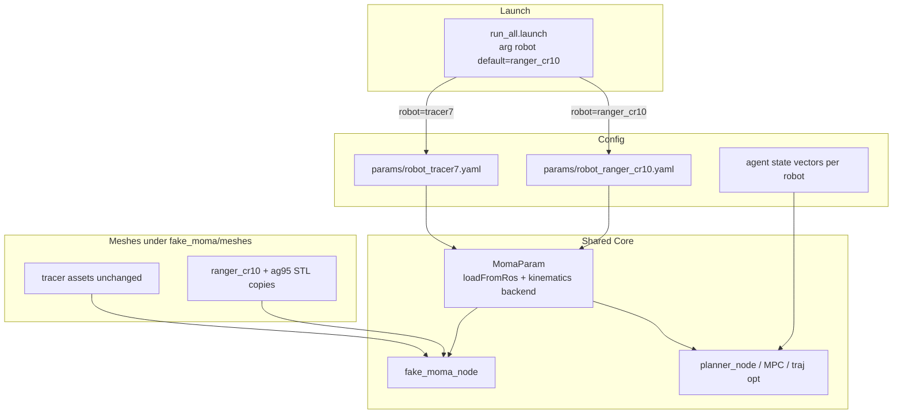

# TopAY Ranger+CR10 Dual-Robot Design

**Date:** 2026-08-11  
**Status:** Approved for spec (pending user file review)  
**Scope:** TopAY simulation only — swap default mobile manipulator to Ranger chassis + CR10 arm + AG95 gripper, keep original Tracer+7DOF switchable.

## 1. Goals and Non-Goals

### Goals

- Default TopAY sim/planning stack runs **Ranger + CR10 (6-DOF) + AG95**.
- Original **Tracer + 7-DOF** remains available via `robot:=tracer7`.
- Planning geometry (footprint, mount, FK, collision proxies, limits) comes primarily from REMANI `mm_param_ranger_cr10.yaml`.
- AG95 uses real meshes from `agx/rangerboxcr10lidar_description` plus a simple tip collision sphere.
- Keep TopAY algorithms, topic names, and Docker workflow unchanged.

### Non-Goals

- Real-robot AGX bridge / ServoJ / Ranger `cmd_vel` closed loop.
- Changing TopAY to a full Dual-Ackermann base model (keep virtual differential semantics).
- Full benchmark/ablation scene re-tuning for the larger footprint (only `run_all` must work).
- Modeling AG95 finger open/close as planning DOFs (fixed closed envelope only).

## 2. Architecture



| Unit | Responsibility | Interface |
|------|----------------|-----------|
| `params/robot_tracer7.yaml` | Original chassis/arm/collision/mesh params extracted from current `MomaParam()` | ROS params under `moma/` (or agreed prefix) |
| `params/robot_ranger_cr10.yaml` | REMANI-mapped Ranger/CR10 + AG95 tip sphere | same |
| `MomaParam` | Load YAML; dispatch FK/collision/grads by `kinematics` | existing `getFKPose` / `getColliPts` / `getEEGrads` / `getColliGrads` |
| `fake_moma` | Integrate cmd, publish state, draw meshes | `MomaState` / `MomaCmd` (already variable-length) |
| Launch | Select robot YAML; default `ranger_cr10` | `robot:=ranger_cr10\|tracer7` |

## 3. Kinematics Backends (Critical)

TopAY’s built-in FK/collision chain uses an **alternating-axis** model hard-coded in `getFKPose` / `getColliPts`. REMANI CR10 uses a different `getAJointTran` + `manipulator_config` chain. These are **not interchangeable** by only changing `dof_num` and link lengths.

### Decision

`MomaParam` gains:

```text
kinematics: topay_alt | cr10
```

| Value | Used by | Behavior |
|-------|---------|----------|
| `topay_alt` | `tracer7` | Keep current FK / collision / analytic grads |
| `cr10` | `ranger_cr10` | CR10 joint transforms aligned with REMANI; mount from `base_mani_fixed_joint_xyz_ypr`; collision spheres from mapped thickness + AG95 tip sphere |

Analytic `getEEGrads` / `getColliGrads` for `cr10` **must** be implemented in the first shippable version (no silent “grad approx” that breaks MINCO). Port or re-derive consistently with the CR10 forward map.

## 4. Parameter Mapping

### Source of truth for Ranger+CR10

`remani_planner/.../mm_param_ranger_cr10.yaml`:

- Base footprint: length 1.10, width 0.90, height 0.15
- Virtual differential: `mobile_base_wheel_base` 0.56, wheel radius 0.125, wheel omega/alpha limits
- Mount: `[0.2462, 0.0, 0.1, 0, 0, 0]`
- Arm: DOF 6, `manipulator_config`, pos limits, `manipulator_thickness` / `manipulator_self_thickness`

### Target YAML fields (`robot_ranger_cr10.yaml`)

| TopAY field | Mapping |
|-------------|---------|
| `chassis_length/width/height` | 1.10 / 0.90 / 0.15 |
| `chassis_colli_radius` | Conservative disk covering footprint; document relation to REMANI check spheres in comments |
| Chassis speed limits | Derived from wheel omega × radius and virtual track, or fixed constants documented as REMANI-equivalent |
| `dof_num` | 6 |
| `relative_t` / `relative_R` | From mount xyz + ypr |
| Link / collision arrays | From `manipulator_config` + thickness policy (obstacle thick / self thin) |
| Joint limits / vel / acc | From REMANI yaml (`max_vel`/`max_acc` and pos limits) |
| `ag95_colli_radius` + flange offset | New; sphere after CR10 tip |
| `mesh_prefix` / mesh file list | `package://fake_moma/meshes/ranger_cr10/...` |
| `kinematics` | `cr10` |

### Tracer profile

`robot_tracer7.yaml` is a literal extraction of today’s constructor defaults; `kinematics: topay_alt`; original mesh paths.

### Agent start/goal dimensions

- `tracer7`: state length **10** = `(x, y, yaw) + 7q` (current)
- `ranger_cr10`: state length **9** = `(x, y, yaw) + 6q`

Load via separate agent overlay YAML or launch-selected param file so fixed `pick_state` / `mid_state` / `place_state` match DOF.

## 5. DOF De-Hardcoding

Replace hardcoded `.tail(7)` / literal `7` arm widths with `moma_param.dof_num` in planner/MPC/traj-opt sources (notably `moma_traj_opt*.cpp`, `moma_traj_opt.h`, `ompc.cpp`, and any remaining call sites).

`MomaState.msg` / `MomaCmd.msg` already use variable arrays — **no message schema change**. Runtime asserts: command `q` length and `arm_odom` size equal `dof_num`.

## 6. Simulation and Visualization

- Copy meshes from `agx/rangerboxcr10lidar_description/meshes` (`ranger_meshes`, `cr10_meshes`, `ag95_meshes`, related base/box as needed) into `TopAY/src/simulator/fake_moma/meshes/ranger_cr10/` so Docker builds are self-contained.
- Keep existing Tracer meshes and gripper assets untouched.
- `moma_sim` / `moma_vis` select mesh resources from the active robot profile; AG95 attached at CR10 tip pose.
- Collision debug markers continue to use existing cylinder/point helpers fed by `MomaParam`.

## 7. Launch UX

```bash
# Default Ranger+CR10
roslaunch planner run_all.launch rviz:=true

# Original robot
roslaunch planner run_all.launch robot:=tracer7 rviz:=true
```

`run_all.launch` (and other entry launches that start `fake_moma` + planner) gain `arg robot` defaulting to `ranger_cr10`, load the matching robot YAML, and load DOF-matching agent states.

## 8. Error Handling

- Unknown `robot` value or missing required YAML keys → fail fast (`GET_PARAM_OR_THROW` / `ROS_FATAL`).
- DOF mismatch between params and incoming command/state → reject and fatal log.
- Missing mesh resources → explicit path error; do not publish empty markers silently.

## 9. Acceptance Criteria

1. `robot:=tracer7` regresses to current visual/planning behavior on the standard `run_all` scene.
2. Default `ranger_cr10` shows Ranger + CR10 + AG95 in RViz; zero-configuration pose visually matches REMANI/URDF within ~2–3 cm at EE (spot check).
3. At least one successful plan (or clearly explained failure: collision/timeout) for fixed and/or random start–goal under `ranger_cr10`.
4. Self-collision: a known folded CR10 pose is rejected; a known open pose passes.
5. Switching robots requires only the launch argument (no code rebuild flags).

## 10. Risks and Mitigations

| Risk | Mitigation |
|------|------------|
| Wrong FK if CR10 forced into `topay_alt` | Hard requirement for dual kinematics backends |
| Narrow map corridors vs Ranger footprint | Validate on current map first; document if map/margins need later tuning |
| AG95 open/close not planned | Fixed closed envelope sphere only |
| Large mesh copy in git | Accept for Docker self-containment; only required visual meshes |

## 11. Implementation Order

1. Extract `robot_tracer7.yaml` + `MomaParam::loadFromRos`; verify tracer regression.
2. Replace hardcoded arm width `7` with `dof_num`.
3. Implement `cr10` kinematics/collision/grads + `robot_ranger_cr10.yaml`.
4. Vendor meshes; wire vis + AG95 tip sphere.
5. Launch default + agent state overlays.
6. Run acceptance checklist.

## 12. Decisions Log

| Decision | Choice |
|----------|--------|
| Target stack | TopAY only |
| Success depth | Full sim planning model + vis + switchable original |
| Default robot | `ranger_cr10` |
| Switch UX | `robot:=tracer7` |
| Param source | REMANI `mm_param_ranger_cr10.yaml` |
| Gripper | AG95 mesh + simple collision sphere |
| Approach | Config-driven dual `MomaParam` (Approach 1) |
